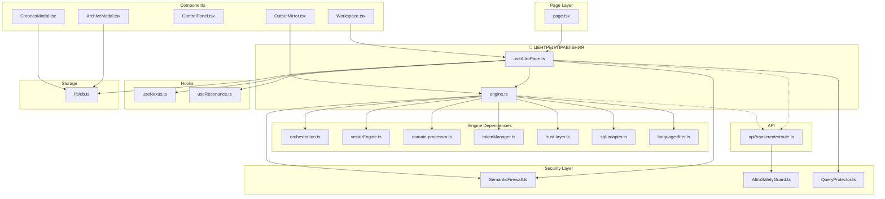

# ALTRO LIBRA V2.1 — АРХИТЕКТУРНЫЙ АУДИТ

**Дата:** 16 марта 2026  
**Роль:** System Auditor & Software Architect  
**Миссия:** Карта местности, целостность воронки, мосты между памятью, firewall & dead zones

---

## 1. КАРТА СВЯЗЕЙ (FILE TOPOLOGY)

### 1.1 Визуальная схема (Mermaid)



### 1.2 Иерархия Hub-файлов

| Уровень | Файл | Роль |
|---------|------|------|
| **Tier 0** | `useAltroPage.ts` | Главный оркестратор UI: объединяет Nexus, Resonance, Engine, Firewall, DB |
| **Tier 0** | `engine.ts` | Ядро ALTRO: промпты, оркестратор, SemanticFirewall, Chronos |
| **Tier 1** | `page.tsx` | Точка входа приложения, потребляет useAltroPage |
| **Tier 1** | `api/transcreate/route.ts` | API-прокси к Ollama, AltroSafetyGuard |
| **Tier 2** | `useNexus.ts`, `useResonance.ts` | Источник текста, весов, OPR |
| **Tier 2** | `orchestration.ts`, `vectorEngine.ts` | Токенизация, веса, сценарии |

### 1.3 Карта импортов ключевых узлов

**useAltroPage.ts** импортирует:
- `engine` (AltroOrchestrator, tokenizeText, buildLocalAuditLog, …)
- `useNexus`, `useResonance`
- `SemanticFirewall`, `QueryProtector`
- `DomainEngine`, `CommandProcessor`, `addVaultRecord`
- `altroData`, `altroLogic`, `foundation`, `voiceService`

**engine.ts** импортирует:
- `altroData`, `tokenManager`, `textUtils`, `domain-processor`
- `trust-layer`, `sql-adapter`, `language-filter`
- `SemanticFirewall`
- Re-exports: `orchestration`, `language-filter`, `domain-processor`, `trust-layer`, `vectorEngine`, `textUtils`, `tokenManager`

### 1.4 Циклические зависимости

**Результат:** Циклических зависимостей не обнаружено.

- `engine` → `orchestration` (re-export); `orchestration` не импортирует `engine`
- `useAltroPage` → `useNexus`, `useResonance`; обратных импортов нет
- `SemanticFirewall` → `sql-adapter`; `sql-adapter` не импортирует `SemanticFirewall`

---

## 2. ТАБЛИЦА «ЗДОРОВЬЯ» КОМПОНЕНТОВ

| Файл | Роль | Статус | Проблемы |
|------|------|--------|----------|
| `useAltroPage.ts` | Hub UI | 🟢 Green | — |
| `engine.ts` | Hub Engine | 🟢 Green | — |
| `api/transcreate/route.ts` | API Proxy | 🟡 Yellow | Детали блокировки (code, reason) не доходят до фронтенда |
| `AltroSafetyGuard.ts` | Vector №3 | 🟡 Yellow | Возвращает code/reason, но API их не прокидывает |
| `SemanticFirewall.ts` | Inverted Funnel | 🟢 Green | — |
| `ChronosModal.tsx` | Логи Chronos | 🔴 Red | Нет onClick — клик по логу не восстанавливает состояние |
| `ArchiveModal.tsx` | Vault | 🟡 Yellow | Восстанавливает Radar, но не OPR (resonance) |
| `lib/db.ts` | IndexedDB | 🟡 Yellow | Chronos хранит только `radar: internal` (5 доменов), не полный DomainWeights |
| `page.tsx` | Entry | 🟢 Green | — |
| `orchestration.ts` | Токены, оркестрация | 🟡 Yellow | Остатки `bridge` в типах (устаревший preset) |

---

## 3. ЦЕЛОСТНОСТЬ ВОРОНКИ (DATA PIPELINE)

### 3.1 Путь запроса

```
Nexus (useNexus)
    │ sourceText, nexusCommand, onRunScan
    ▼
useAltroPage
    │ runScan() → altroOrchestrator.request()
    ▼
engine.ts (AltroOrchestrator.request)
    │ 1. SemanticFirewall.evaluate(intentVector, { lockedTokens, requestText })
    │    → Если !allowed: return "⚠️ Семантическая блокировка: {reportLine}"
    │ 2. buildOllamaPayload() → fetch('/api/transcreate')
    ▼
api/transcreate/route.ts
    │ checkRequest(body) from AltroSafetyGuard
    │ → Если !allowed: 403 { error: 'Security Policy Violation' }
    │ → Если allowed: proxy to Ollama
    ▼
Ollama /api/chat
    │ stream: true
    ▼
Streaming Response → onChunk → setDisplayedAdaptation
```

### 3.2 Статус здоровья по этапам

| Этап | Статус | Метаданные |
|------|--------|------------|
| Nexus → useAltroPage | 🟢 | sourceText, nexusCommand, domainWeights, oprPrismValue передаются |
| useAltroPage → Engine | 🟢 | calibration, tokens, targetLanguage, sessionId передаются |
| Engine (SemanticFirewall) | 🟢 | Блокировка возвращает reportLine в строке |
| Engine → API | 🟢 | _altroDebug (targetLanguage, oprIntensity) в payload |
| API (AltroSafetyGuard) | 🟡 | code, reason логируются, но не возвращаются в body |
| API → Ollama | 🟢 | Проксирование стрима корректно |
| Response → UI | 🟢 | 403 → setSecurityBlocked(true), setDisplayedAdaptation('Security Policy Violation') |

### 3.3 Анализ воронки

**Движение данных:**
1. **Source** — Nexus (textarea) → `sourceText` (useResonance/useNexus)
2. **Calibration** — Radar (domainWeights) + OPR (oprPrismValue) → `altroCalibration`
3. **Intent** — `calibrationToVector()` → 13-мерный вектор для SemanticFirewall
4. **Request** — `buildOllamaPayload()` → messages, system prompt, user content
5. **Response** — stream chunks → `onChunk` → `setDisplayedAdaptation`
6. **Post-processing** — `applyLibraPostProcessing`, `verifyResonance`, `logToChronos`

**Разрывы:**
- При 403 от API: фронтенд получает только `"Security Policy Violation"`, без `code` (ETHICS_VIOLATION, LAW_VIOLATION и т.д.) и без `reason`.

---

## 4. МОСТЫ МЕЖДУ ПАМЯТЯМИ (TRIPLE STORAGE AUDIT)

### 4.1 Три системы хранения

| Система | Хранилище | Содержимое |
|---------|-----------|------------|
| **РЕЗУЛЬТАТЫ** | Vault (IndexedDB) | source, result, radar, model, timestamp |
| **НАСТРОЙКИ** | React State (useResonance) | domainWeights, oprPrismValue |
| **ХРОНОС** | Chronos (IndexedDB) | source, result, radar, model, timestamp, generationTimeMs, tokenCount |

### 4.2 Изоляция и связи

**Vault (ArchiveModal):**
- Запись: `addVaultRecord({ type, resonance, source, result, radar, model, timestamp })`
- Восстановление: `onSelectRecord` → setSourceText, setDisplayedAdaptation, setDomainWeights
- **Проблема:** `resonance` (OPR) не сохраняется в схеме VaultRecord и не восстанавливается

**Chronos (ChronosModal):**
- Запись: `logToChronos` в engine.ts → `radar: params.calibration?.internal || {}` (только 5 внутренних доменов!)
- **Проблема:** ChronosModal не имеет `onSelectRecord` — клик по логу ничего не делает
- **Проблема:** radar в Chronos усечён (нет 8 внешних доменов)

**Snapshots (localStorage):**
- Полные: domainWeights, oprPrismValue, activePreset, selectedScenario
- Восстановление: `applySnapshot` → setDomainWeights, setOprPrismValue, setActivePreset, setSelectedScenario

### 4.3 Чего не хватает для «клик по логу Chronos → восстановить Radar + открыть текст в Vault»

| Требование | Статус |
|------------|--------|
| ChronosModal: onClick на запись | ❌ Отсутствует |
| ChronosModal: onSelectRecord callback | ❌ Отсутствует |
| Chronos: полный radar (13 доменов) | ❌ Сейчас только internal (5) |
| Chronos: resonance (OPR) в схеме | ❌ Используется для name, не в ChronosRecord |
| page.tsx: обработчик для Chronos | ❌ ChronosModal не передаёт onSelectRecord |

---

## 5. FIREWALL & «МЕРТВЫЕ ЗОНЫ»

### 5.1 Детали блокировки до фронтенда

**api/transcreate/route.ts:**
```typescript
if (!guardResult.allowed) {
  console.warn('[ALTRO SAFETY] Request blocked:', guardResult.code, guardResult.reason);
  return Response.json({ error: 'Security Policy Violation' }, { status: 403 });
}
```

**Вывод:** `code` (ETHICS_VIOLATION, LAW_VIOLATION, …) и `reason` до фронтенда не доходят. В body возвращается только `{ error: 'Security Policy Violation' }`.

**engine.ts / useAltroPage.ts:**
- При 403: `err.message.includes('Security Policy Violation')` → `setSecurityBlocked(true)`
- Специфичный code/reason не используется

### 5.2 Мёртвые зоны и устаревший код

| Расположение | Описание |
|--------------|----------|
| `useAltroPage.ts:340-341` | Закомментированный `[MIDDLEWARE PREP]: semanticFirewallCheck` — мёртвый код, firewall уже в engine |
| `orchestration.ts`, `CommandProcessor.ts`, `MeaningMenu.tsx`, … | Тип `'bridge'` в preset — устаревший, маппится в `transfigure` в CommandProcessor |
| `engine.ts:1056` | JSDoc упоминает `bridge` в @param mode |

**ArchiveDrawer:** Ссылок не найдено — удалён корректно.

---

## 6. РЕКОМЕНДАЦИИ

### 6.1 Связность памятей

1. **ChronosModal:** Добавить `onSelectRecord?: (record: ChronosRecord) => void` и вызывать при клике по записи.
2. **page.tsx:** Передать в ChronosModal обработчик, восстанавливающий source, result, domainWeights, oprPrismValue (если будут в записи).
3. **logToChronos:** Сохранять полный `radar` (DomainWeights) и `resonance` (OPR), а не только `calibration.internal`.
4. **VaultRecord:** Добавить поле `resonance?: number` и восстанавливать OPR в `onSelectRecord`.
5. **ChronosRecord:** Добавить `resonance?: number`, хранить полный radar.

### 6.2 Firewall

1. **API route:** Возвращать в body при 403: `{ error: '...', code: guardResult.code, reason: guardResult.reason }`.
2. **engine.ts / useAltroPage:** Обрабатывать `code` и `reason` из ответа для отображения пользователю (например, в tooltip или отдельном блоке).

### 6.3 Очистка

1. Удалить закомментированный блок `[MIDDLEWARE PREP]` в useAltroPage.ts.
2. Унифицировать типы preset: убрать `bridge` из интерфейсов, оставить только `mirror | transfigure | slang`.

---

*Отчёт подготовлен на основе статического анализа кодовой базы.*
